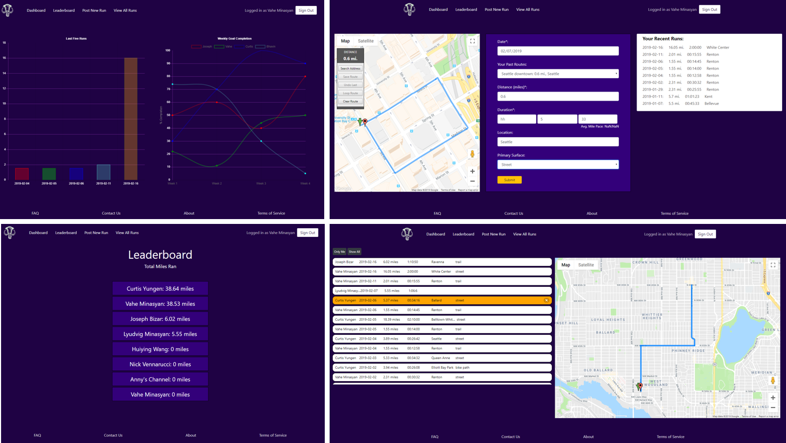

# Mammoth App

### Overview
The Mammoth app is logging and tracking tool for runners. It allows users to log runs of varying types and share/compare results with other users. The app is deployed in Heroku and avaible at [mammoth-app.herokuapp.com](https://mammoth-app.herokuapp.com/). Check it out!

### Technology used
- Node.js
- Express
- Axios
- Handlebars
- jQuery
- Moment.js
- Chart.js
- Sequelize
- MySQL
- Google Oauth 2.0
- Bulma CSS framework
- Google Maps API
- Heroku
- JawsDB

### How the App Works
The app uses [Google sign-in](https://developers.google.com/identity/sign-in/web/sign-in) for user authentication. User will need to use his existing google account or create one if they don't have it. Once signed in it loads the dashboard with graphs of five recent runs. To post a new run user needs to navigate to the `Post New Run` page. On that page they can use the map to create a route and the form to log the run. After run is saved it'll be displayed in the `Your Recent Runs` box. To view full details for each run user can navigate to the `View All Runs` page from where he can also delete runs and switch between views to show only his runs or all users runs. The `Leaderboard` page provides summary of total miles ran by each user in the descending order. 

### How to Setup 
1. After cloning this repo run `npm install` to install all dependencies. 
2. We use sequelize to setup and connect to MySQL database. 
3. Inside a folder `config` there is a sequelize `config.js` file. Open it and update the development object with your MySQL password.
4. Inside your terminal or Bash window run `node server` and navigate to `localhost:3000` to view the app.

### Future development
Our team is currently working on improving current functionalities and adding a few more. Checkout this [issue](https://github.com/vaheminasyan2/Mammoths/issues/60) to see what is in our road map. 
